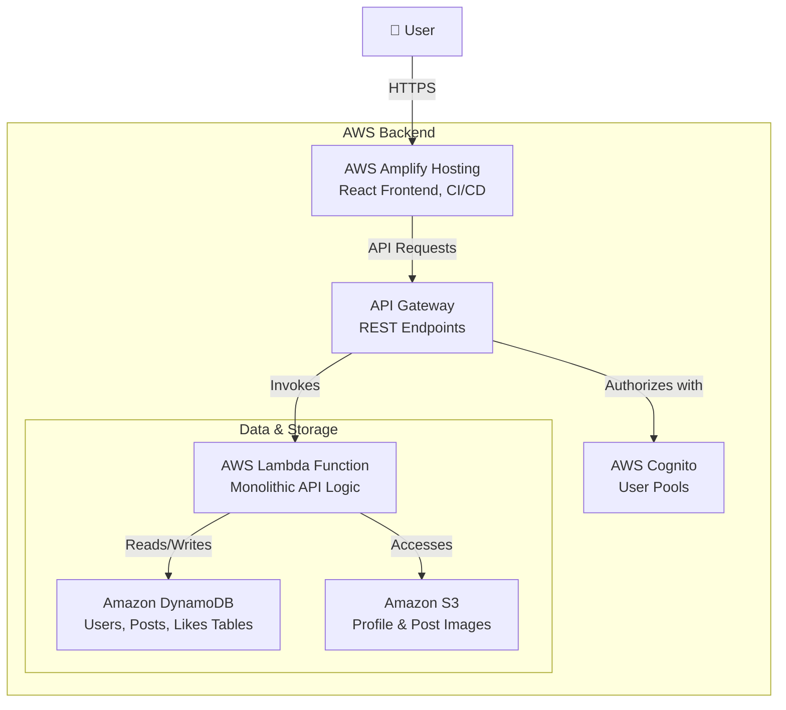

# Synopsis: EchoMateLite - A Social Media Platform

## ● Problem Statement

"EchoMateLite" is a startup social media platform designed to be lightweight and user-friendly. Currently, the application exists as a local frontend build, lacking the necessary backend infrastructure for real-world operation. The core challenge is to transition this local concept into a fully functional, publicly accessible, and scalable cloud application. This involves architecting and deploying a complete backend system on Amazon Web Services (AWS) from the ground up. The project requires implementing foundational features such as secure user authentication, dynamic profile management, and the ability for users to create and view posts. The solution must be cost-effective, leveraging serverless technologies to minimize operational overhead and scale seamlessly with user growth, providing a robust foundation for the platform's future. This project serves as a practical, hands-on exercise in applying fundamental cloud engineering principles to a real-world scenario.

## ● Goals and Objectives

The primary goal of this project is to successfully deploy the "EchoMateLite" social media platform as a secure, scalable, and cost-efficient application on the AWS cloud.

**Objectives:**
1.  **Implement Secure User Management:** To build a complete authentication and authorization system using AWS Cognito, allowing users to sign up, log in, and manage their sessions securely.
2.  **Establish a Serverless Backend:** To create a robust, event-driven backend using AWS Lambda and API Gateway, which will handle all business logic without the need to manage servers.
3.  **Deploy a Scalable Database and Media Storage:** To design and implement a flexible NoSQL database with Amazon DynamoDB and a durable object storage solution with Amazon S3, ensuring data integrity and efficient media handling.
4.  **Enable Continuous Deployment for the Frontend:** To configure a CI/CD pipeline using AWS Amplify Hosting, enabling automatic builds and deployments of the React frontend from a Git repository, ensuring rapid and reliable updates.

## ● Key Features / Expected Results

The successful deployment of EchoMateLite will result in a fully functional Minimum Viable Product (MVP) with the following key features:

**1. Secure User Authentication:** The platform will provide a secure and seamless authentication experience.
*   **Implementation:** AWS Cognito will be used to manage the entire user lifecycle, including user registration with email and password, secure sign-in, and session management using JWT tokens. Cognito handles all aspects of password hashing and secure storage. The API Gateway will feature a Cognito authorizer to protect sensitive endpoints, ensuring only authenticated users can access or modify their data.
*   **Expected Result:** A robust login and registration system where users can confidently create accounts and interact with the platform. This system is the foundation for all user-specific features.
*   **Suggested Frontend Screenshot:** The landing page (`Landing.tsx`) showing the Sign-Up and Login forms.

**2. Dynamic Profile Management:** Users will have a personalized space within the application that they can customize.
*   **Implementation:** Once logged in, users can navigate to their profile page. An "Edit" button will launch a modal allowing them to update their full name, a one-liner bio, and a longer description. They will also be able to upload a new profile picture and a cover banner image. These actions will trigger an authenticated API call to a Lambda function, which will update the user's corresponding item in the `Users` DynamoDB table and upload the new images to the designated S3 bucket.
*   **Expected Result:** A dynamic and engaging user experience where profiles are unique and reflect the user's personality. All data will be persistently stored and retrieved upon subsequent visits.
*   **Suggested Frontend Screenshots:**
    *   The main Profile page (`Profile.tsx`) displaying the user's information, profile picture, cover banner, and post/like counts.
    *   The "Edit Profile" modal, showing the input fields and image upload buttons.

**3. Post Creation and Viewing:** This is the core social feature of the platform.
*   **Implementation:** Authenticated users will be able to create new posts consisting of text and an accompanying image. When a user submits a post, the frontend will call a Lambda function via API Gateway. The function will generate a unique `postId`, upload the image to S3, and create a new record in the `Posts` DynamoDB table, linking the post to the user. Liking a post will be an atomic operation, updating both the `Posts` and `Users` tables to reflect the new like counts.
*   **Expected Result:** A live, interactive feed of user-generated content, forming the central hub of the social platform. The architecture will support real-time updates for post creation and likes.
*   **Suggested Frontend Screenshot:** The user's own profile page, which lists the posts they have created, demonstrating the post viewing feature.

## ● Preliminary Findings on the likely AWS services to be used

The architecture for EchoMateLite will be built entirely on serverless AWS services to ensure maximum cost-efficiency, scalability, and minimal operational maintenance. The free tiers offered by these services are sufficient to run the MVP at little to no cost.

The selected services are:
*   **AWS Amplify Hosting:** For deploying the React frontend. It provides a git-based CI/CD workflow, a global CDN (CloudFront), and free SSL/HTTPS, making frontend deployment seamless.
*   **AWS Cognito:** For user authentication. It provides a fully managed user directory and handles all the complexities of sign-up, sign-in, and token-based security.
*   **API Gateway & AWS Lambda:** This pair forms the core of our serverless backend. API Gateway provides secure REST endpoints, while a single monolithic Lambda function will contain all the business logic. This approach is simple and cost-effective, as we only pay when the API is used.
*   **Amazon DynamoDB:** A fully managed NoSQL database chosen for its performance and scalability. With on-demand capacity, it perfectly fits our model, ensuring we only pay for the reads and writes we perform.
*   **Amazon S3:** Used for all media storage. Its durability and low cost make it the ideal choice for storing user-uploaded images securely.

This serverless architecture diagram illustrates the data flow:

