# Synopsis: EchoMateLite – A Serverless Social Platform on AWS

## ● Problem Statement

EchoMateLite is a startup social media platform with a functional frontend but no backend infrastructure. The core challenge is to deploy this application on the cloud, transforming it from a local prototype into a publicly accessible and scalable service. The project requires designing and implementing a complete serverless backend on AWS to enable essential features such as secure user authentication, dynamic profile management, and post creation. The solution must remain cost-effective while supporting future growth and increased user demand.

---

## ● Goals and Objectives

The primary goal of this project is to successfully deploy EchoMateLite as a secure, scalable, and cost-efficient application using serverless services on AWS.

**Objectives:**
1. **Implement Secure User Management:** Use AWS Cognito for full authentication and authorization, allowing users to sign up, log in, and manage sessions securely.
2. **Establish a Serverless Backend:** Design a scalable, event-driven backend using AWS Lambda and API Gateway to handle business logic without managing servers.
3. **Deploy a Flexible NoSQL Database and Media Storage:** Use Amazon DynamoDB and Amazon S3 to store user data and media efficiently and reliably.
4. **Enable Continuous Deployment for the Frontend:** Set up a CI/CD pipeline using AWS Amplify Hosting to deploy the frontend automatically from a Git repository.

---

## ● Key Features

### 1. 🔐 Secure User Authentication
- **Functionality:** Users can create accounts, sign in, and securely manage sessions. Private routes are protected.
- **Implementation:** AWS Cognito manages user credentials, password hashing, and JWT token generation. API Gateway integrates with Cognito to protect all backend routes using authorizers.
- **Expected Result:** A robust and secure user authentication system.
  

---

### 2. 👤 Dynamic Profile Management
- **Functionality:** Users can update their profile information including name, bio, profile picture, and banner image.
- **Implementation:** A modal form allows users to edit their data. The frontend uses file inputs and the FileReader API to preview images. Changes trigger authenticated API calls to Lambda functions, updating the `Users` table in DynamoDB and uploading images to S3.
- **Expected Result:** A persistent and customizable user profile experience.

---

### 3. 📝 Post Creation and Viewing
- **Functionality:** Users can create text/image posts and view them on their profile feed.
- **Implementation:** On form submission, the frontend sends post data and image via a secure API call. The Lambda function assigns a unique `postId`, uploads the image to S3, and inserts the post into the `Posts` table in DynamoDB.
- **Expected Result:** A working social feed showing user-generated posts and images.

---

## ● Technology Architecture

### 🧩 Frontend
- **Framework:** React with TypeScript, built using Vite
- **Styling:** Tailwind CSS (utility-first CSS framework)
- **Routing:** React Router DOM for client-side navigation
- **Media Handling:** Native `<input type="file">` elements and FileReader API
- **Deployment:** AWS Amplify Hosting (CI/CD, CDN, SSL)

---

### 🛠️ Backend
- **Architecture:** A serverless monolithic Lambda function handles all business logic. This design simplifies the MVP and can be modularized in the future.
- **Authentication:** AWS Cognito handles user pools and token-based authentication.
- **API Layer:** API Gateway exposes REST endpoints and integrates with Cognito authorizers.
- **Database:** Amazon DynamoDB (on-demand) is used for `Users`, `Posts`, and `Likes` tables.
- **Media Storage:** Amazon S3 securely stores all uploaded images.
- **Monitoring:** AWS CloudWatch logs all API and Lambda activity.

---

## ● System Architecture Diagram

```mermaid
graph TD
    User[👤 User] -- HTTPS --> Amplify[AWS Amplify Hosting <br> React/TS Frontend];

    subgraph "AWS Serverless Backend"
        Amplify -- API Calls --> APIGateway[API Gateway <br> REST Endpoints];
        APIGateway -- Authorizes --> Cognito[AWS Cognito <br> User Authentication];
        APIGateway -- Invokes --> Lambda[Monolithic Lambda Function <br> API Business Logic];
        
        Lambda -- Accesses --> DynamoDB[DynamoDB <br> Users, Posts, Likes Tables];
        Lambda -- Accesses --> S3[S3 Bucket <br> Image Storage];
        Lambda -- Logs to --> CloudWatch[CloudWatch <br> Logs & Metrics];
    end
```

