# Synopsis: EchoMateLite - A Social Media Platform

## ● Problem Statement

"EchoMateLite" is a startup social media platform with a functional frontend but no backend infrastructure. The core challenge is to deploy this application on the cloud, transforming it from a local concept into a publicly accessible and scalable service. The project requires architecting and implementing a complete serverless backend on AWS to enable essential features like secure user authentication, dynamic profile management, and post creation. The solution must be cost-effective and scalable to support future growth.

## ● Goals and Objectives

The primary goal of this project is to successfully deploy the "EchoMateLite" social media platform as a secure, scalable, and cost-efficient application on the AWS cloud.

**Objectives:**
1.  **Implement Secure User Management:** To build a complete authentication and authorization system using AWS Cognito, allowing users to sign up, log in, and manage their sessions securely.
2.  **Establish a Serverless Backend:** To create a robust, event-driven backend using AWS Lambda and API Gateway, which will handle all business logic without the need to manage servers.
3.  **Deploy a Scalable Database and Media Storage:** To design and implement a flexible NoSQL database with Amazon DynamoDB and a durable object storage solution with Amazon S3, ensuring data integrity and efficient media handling.
4.  **Enable Continuous Deployment for the Frontend:** To configure a CI/CD pipeline using AWS Amplify Hosting, enabling automatic builds and deployments of the React frontend from a Git repository.

## ● Key Features

#### 1. Secure User Authentication
*   **Functionality:** Users can create an account, log in, and log out securely. The system protects user data and private routes.
*   **Implementation:** The system uses AWS Cognito to manage the entire user lifecycle, including password hashing and JWT token generation. An API Gateway Cognito authorizer secures all protected backend endpoints.
*   **Expected Result:** A reliable and secure authentication system that grants users access to the platform and forms the foundation for all personalized features.
(pictures/Screenshot from 2025-08-03 11-44-25.png)[Login Page]

#### 2. Dynamic Profile Management
*   **Functionality:** Users can create and customize their personal profile with a name, bio, and custom profile and cover pictures.
*   **Implementation:** After logging in, users can edit their profile information via a modal. The frontend uses standard file inputs and the FileReader API to handle image uploads. Authenticated API calls to Lambda update the user's record in the `Users` DynamoDB table and save the new images to the S3 bucket.
*   **Expected Result:** An engaging user experience where profiles are persistent and customizable, with all data and media securely stored in the backend.

#### 3. Post Creation and Viewing
*   **Functionality:** Users can create new posts containing text and an image, and view a feed of their posts on their profile.
*   **Implementation:** The frontend sends the post content and image data to a secure API endpoint. The monolithic Lambda function generates a unique `postId`, uploads the image to S3, and creates a new record in the `Posts` DynamoDB table, linking it to the user's `userId`.
*   **Expected Result:** A core social feed where content can be created and displayed, with a clear and scalable system for managing posts and their associated media.

## ● Technology Architecture

#### Frontend
*   **Framework:** React with TypeScript, built using Vite.
*   **Styling:** Tailwind CSS for a utility-first styling workflow.
*   **Routing:** React Router DOM for client-side navigation.
*   **Media Handling:** Native browser File Inputs and the FileReader API for processing image uploads before sending to the backend.
*   **Hosting:** AWS Amplify Hosting, providing a git-based CI/CD workflow, global CDN, and free SSL/TLS encryption.

#### Backend
*   **Architecture:** A serverless, monolithic API approach was chosen for MVP simplicity and low cost. A single AWS Lambda function contains all the API business logic. This can be refactored into microservices as the application scales.
*   **Authentication:** AWS Cognito handles user pools and identity management.
*   **API Layer:** Amazon API Gateway exposes the RESTful endpoints and integrates with Cognito for request authorization.
*   **Database:** Amazon DynamoDB (NoSQL) is used with on-demand capacity for the `Users`, `Posts`, and `Likes` tables.
*   **Media Storage:** Amazon S3 stores all user-uploaded images (profile pictures, cover banners, and post images).
*   **Monitoring:** AWS CloudWatch is used for default, automatic logging and monitoring of all API Gateway requests and Lambda function executions.

```mermaid
graph TD
    User[👤 User] -- HTTPS --> Amplify[AWS Amplify Hosting <br> React/TS Frontend];

    subgraph "AWS Serverless Backend"
        Amplify -- API Calls --> APIGateway[API Gateway <br> REST Endpoints];
        APIGateway -- Authorizes --> Cognito[AWS Cognito <br> User Authentication];
        APIGateway -- Invokes --> Lambda[Monolithic Lambda Function <br> API Business Logic];
        
        Lambda -- Accesses --> DynamoDB[DynamoDB <br> Users, Posts, Likes Tables];
        Lambda -- Accesses --> S3[S3 Bucket <br> Image Storage];
        Lambda -- Logs to --> CloudWatch[CloudWatch <br> Logs & Metrics];
    end
```

