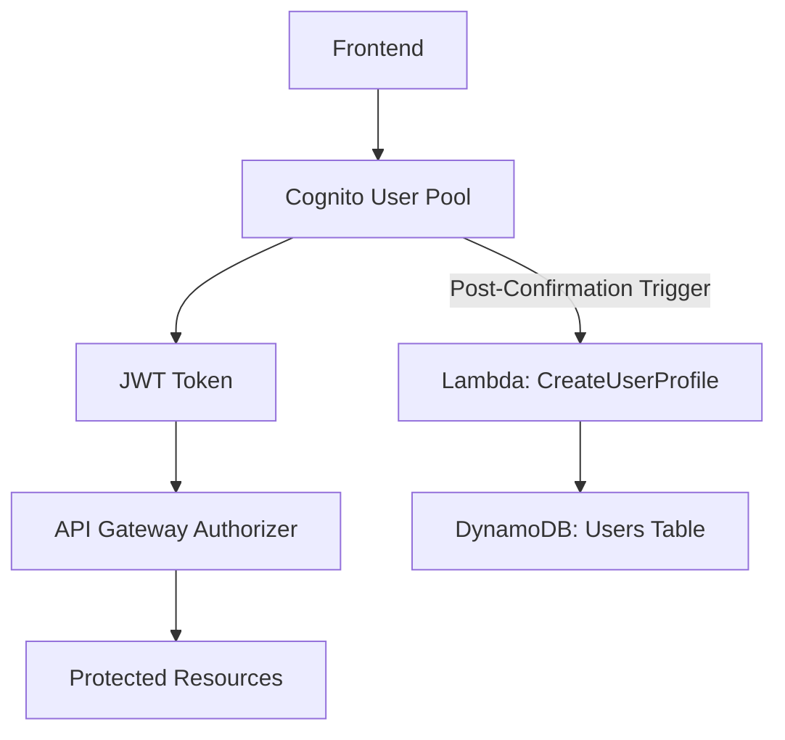
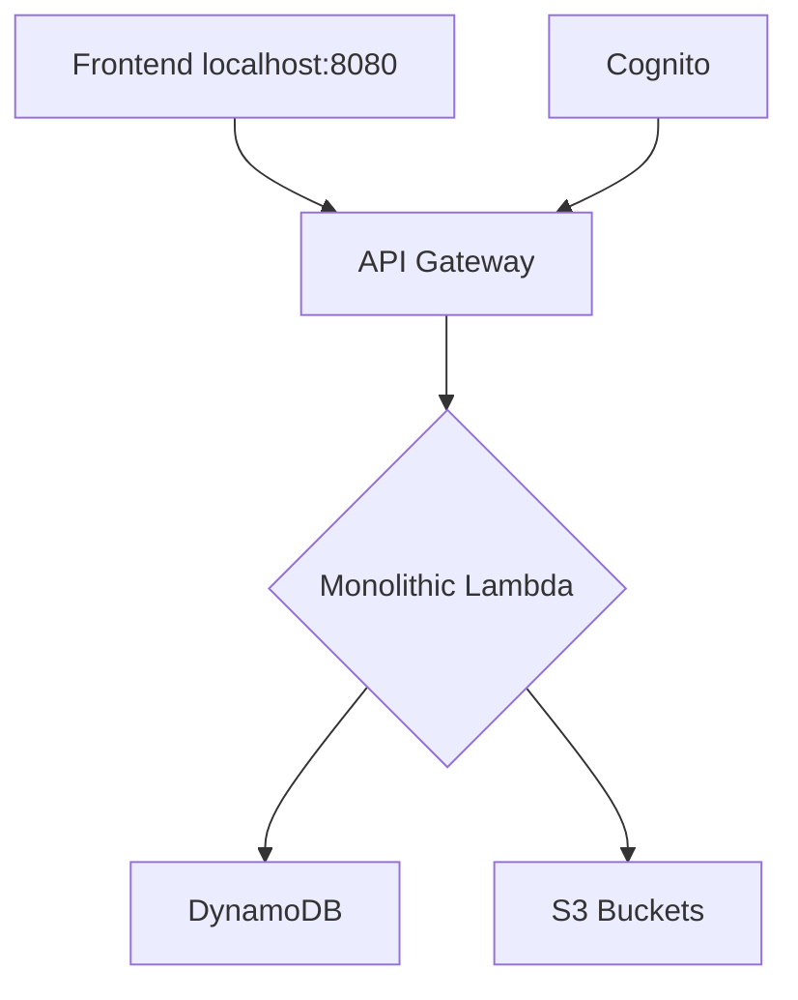
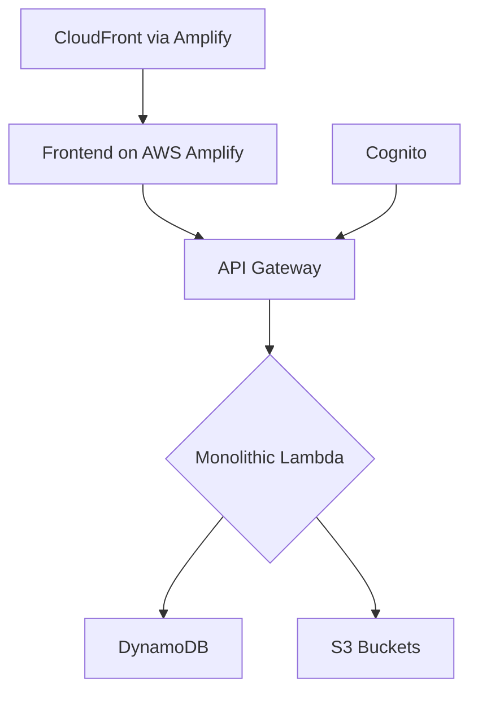

# Echomate Backend Architecture & Construction Plan

## 🏗️ System Architecture Overview

### 1. Authentication & Authorization Layer (AWS Cognito)


#### Components:
- **User Pool**: Manages user accounts and authentication.
- **JWT Tokens**: For secure API access.
- **Cognito Authorizer**: The free, built-in authorizer for API Gateway.
- **Post-Confirmation Trigger**: A Lambda function that runs automatically after a user signs up to create their profile in DynamoDB. This simplifies the frontend logic.

### 2. Database Architecture (DynamoDB - On-Demand)

#### User Table
*Set to On-Demand capacity for cost-effectiveness.*
```json
{
  "userId": "string (primary key)",
  "email": "string",
  "username": "string",
  "profile": {
    "basic": { "fullName": "string", "position": "string", "location": "string", "joinDate": "string" },
    "bio": { "description": "string", "oneLiner": "string", "interests": ["string"] },
    "images": {
      "profile": { "url": "string", "lastUpdated": "timestamp" },
      "cover": { "url": "string", "lastUpdated": "timestamp" },
      "background": { "type": "string (url/gradient)", "value": "string", "lastUpdated": "timestamp" }
    }
  },
  "stats": {
    "posts": { "total": "number" },
    "likes": { "received": "number" }
  },
  "metadata": {
    "createdAt": "timestamp",
    "updatedAt": "timestamp",
    "status": "string (active/inactive)"
  }
}
```

#### Posts Table
*Set to On-Demand capacity for cost-effectiveness.*
```json
{
  "postId": "string (primary key)",
  "userId": "string (GSI)",
  "content": "string",
  "mediaUrls": "string[]",
  "stats": { "likes": "number", "comments": "number" },
  "createdAt": "timestamp"
}
```

#### Interactions (Likes) Table
*Set to On-Demand capacity for cost-effectiveness.*
```json
{
  "postId": "string (Partition Key)",
  "userId": "string (Sort Key)",
  "type": "string (e.g., 'like')",
  "createdAt": "timestamp"
}
```
> **Note:** Using a composite key (`postId` + `userId`) makes checking if a user has already liked a post extremely fast and cheap (`GetItem` operation).

### 3. API Architecture (Lambda & API Gateway)
*   **Strategy:** For MVP simplicity, a **single "monolithic" Lambda function** will be created. It will contain an internal router to handle all API endpoints. This simplifies deployment and dependency management.
> *Note: For scaling beyond MVP, consider splitting this Lambda into micro-Lambdas.*

#### API Endpoints
```plaintext
/users/{userId}/profile  (GET, PUT)
/posts                   (POST)
/posts/{postId}          (GET, PUT, DELETE)
/posts/{postId}/like     (POST, DELETE)
/users/{userId}/posts    (GET)
```

### 4. Media Storage Architecture (S3)

#### Bucket Structure & Cleanup
```plaintext
echomate-media/
  ├── temp/             -- Files land here first. Auto-deleted after 24hrs.
  ├── profiles/
  │   └── {userId}/
  ├── posts/
  │   └── {postId}/
```
- **Cleanup Strategy**: An **S3 Lifecycle Policy** will automatically delete any file in the `temp/` folder older than 24 hours. This is a free, automated way to clean up orphaned uploads.
> *Optional: For future performance, add CloudFront in front of S3 for caching.*

## 🚀 Deployment Architecture

### Development Environment


### Production Environment

