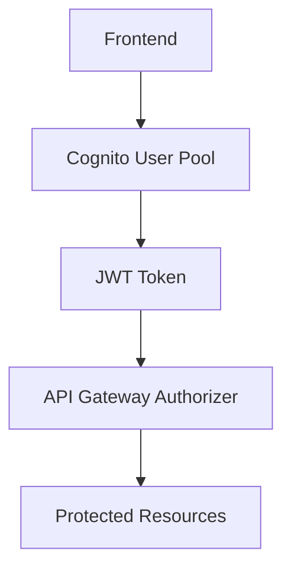
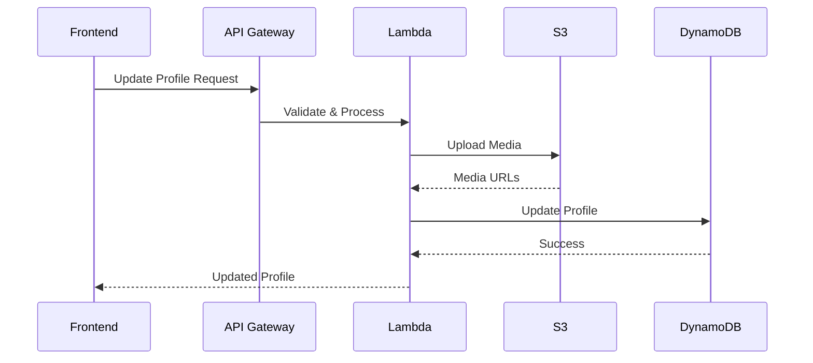
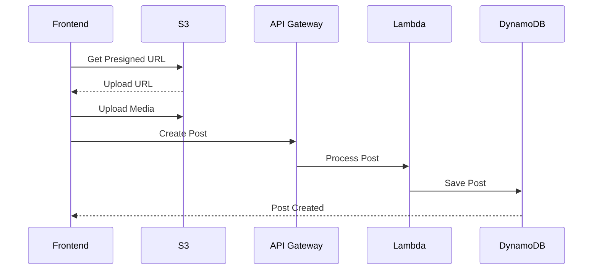
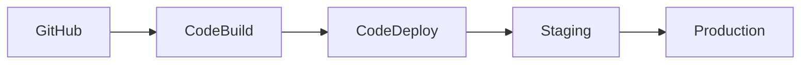

# Echomate Backend Architecture & Construction Plan

## 🏗️ System Architecture Overview

### 1. Authentication & Authorization Layer (AWS Cognito)


#### Components:
- **User Pool**: Manages user accounts and authentication
- **Identity Pool**: Handles AWS service access
- **JWT Tokens**: For secure API access
- **Authorizers**: API Gateway custom authorizers

### 2. Database Architecture (DynamoDB)

#### User Table
```json
{
  "userId": "string (primary key)",
  "email": "string",
  "username": "string",
  "profileData": {
    "fullName": "string",
    "bio": "string",
    "location": "string",
    "profilePicUrl": "string",
    "coverPicUrl": "string"
  },
  "stats": {
    "postsCount": "number",
    "likesCount": "number"
  },
  "createdAt": "timestamp",
  "updatedAt": "timestamp"
}
```

#### Posts Table
```json
{
  "postId": "string (primary key)",
  "userId": "string (GSI)",
  "content": "string",
  "mediaUrls": "string[]",
  "stats": {
    "likes": "number",
    "comments": "number"
  },
  "createdAt": "timestamp",
  "updatedAt": "timestamp"
}
```

#### Interactions Table
```json
{
  "interactionId": "string (primary key)",
  "userId": "string (GSI)",
  "postId": "string (GSI)",
  "type": "string (like/comment)",
  "content": "string (for comments)",
  "createdAt": "timestamp"
}
```

### 3. API Architecture (Lambda & API Gateway)

#### API Endpoints
```plaintext
/auth
  POST /signup
  POST /login
  POST /refresh-token
  POST /forgot-password

/users
  GET /{userId}
  PUT /{userId}/profile
  GET /{userId}/posts
  GET /{userId}/likes

/posts
  POST /
  GET /{postId}
  DELETE /{postId}
  PUT /{postId}
  POST /{postId}/like
  DELETE /{postId}/like
```

### 4. Media Storage Architecture (S3)

#### Bucket Structure
```plaintext
echomate-media/
  ├── profiles/
  │   └── {userId}/
  │       ├── profile-pic.jpg
  │       └── cover-pic.jpg
  ├── posts/
  │   └── {userId}/
  │       └── {postId}/
  │           └── media-1.jpg
```

## 🔄 Data Flow Diagrams

### Profile Update Flow


### Post Creation Flow


## 🔒 Security Architecture

### Network Security
```plaintext
VPC/
  ├── Public Subnet
  │   └── API Gateway
  ├── Private Subnet
  │   ├── Lambda Functions
  │   └── DynamoDB Endpoint
  └── Security Groups
      ├── API Gateway SG
      └── Lambda SG
```

### Data Security
- **At Rest**: AWS KMS encryption
- **In Transit**: HTTPS/TLS
- **Access Control**: IAM + RBAC
- **API Security**: WAF + Rate Limiting

## 💾 Database Access Patterns

### Key Access Patterns
1. **Get User Profile**
   - Primary Key: userId
   - Response: Full profile data

2. **Get User Posts**
   - GSI: userId-createdAt
   - Response: Paginated posts

3. **Get Post with Interactions**
   - Primary Key: postId
   - GSI: postId-createdAt for comments
   - Response: Post + interaction counts

4. **Get User Interactions**
   - GSI: userId-type
   - Response: Liked/commented posts

## 🚀 Scaling Considerations

### DynamoDB Capacity
- **Users Table**: On-demand scaling
- **Posts Table**: Provisioned throughput
- **Interactions Table**: On-demand scaling

### Lambda Configuration
- Memory: 256MB - 512MB
- Timeout: 10-30 seconds
- Concurrency: 100-500

### S3 Performance
- CloudFront CDN
- Presigned URLs
- Lifecycle policies

## 📈 Monitoring & Maintenance

### CloudWatch Metrics
- API Gateway: Latency, 4xx/5xx errors
- Lambda: Duration, errors, throttles
- DynamoDB: Consumed capacity, throttles

### Alerts
- Error rate thresholds
- Latency thresholds
- Cost thresholds

## 🔄 Deployment Strategy

### CI/CD Pipeline


### Environment Configuration
- Development
- Staging
- Production

## 📊 Performance Optimization

### Caching Strategy
- CloudFront for media
- DAX for DynamoDB
- API response caching

### Query Optimization
- Selective attributes
- Parallel queries
- Batch operations
