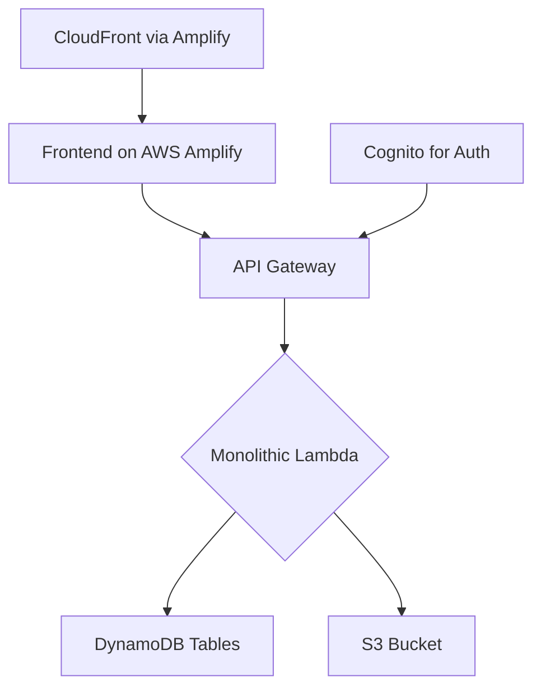

# Echomate Backend Architecture & Construction Plan (Simplified & Complete)

This document outlines a simple, cost-effective, and direct architecture that maps precisely to the core user scenario.

## 🏗️ Core User Scenario
1.  A **User** signs up and gets a unique `userId`.
2.  The user updates their **Profile** (name, description, pictures). These changes are saved against their `userId`.
3.  The user creates a **Post** (text + image), which gets a unique `postId` and is linked to their `userId`. The user's `postsCount` goes up.
4.  Another user **Likes** that post. The post's `likesCount` goes up, and the original poster's `likesReceivedCount` goes up.
5.  The second user can **Unlike** the post, and the counts reverse.
6.  The original user can **Delete** their post, and their `postsCount` goes down.

## 🏛️ System Architecture Overview
*This diagram shows how all the AWS services connect.*


## 📦 Database Architecture (DynamoDB - Simple & Direct)
*All tables will use **On-Demand capacity** for minimum cost.*

#### `Users` Table
*One row per user. Holds all profile information.*
```json
{
  "userId": "string (Primary Key)",
  "email": "string",
  "username": "string",
  "fullName": "string",
  "description": "string",
  "oneLiner": "string",
  "profilePicUrl": "string",
  "coverPicUrl": "string",
  "postsCount": "number",
  "likesReceivedCount": "number",
  "createdAt": "timestamp"
}
```

#### `Posts` Table
*One row per post. Links a post to its creator.*
```json
{
  "postId": "string (Primary Key)",
  "userId": "string (The ID of the user who created it)",
  "content": "string (e.g., 'this is a good day')",
  "imageUrl": "string (The link to the post's image in S3)",
  "likesCount": "number",
  "createdAt": "timestamp"
}
```

#### `Likes` Table
*A simple log to track who liked which post. Prevents duplicate likes.*
```json
{
  "postId": "string (Partition Key)",
  "userId": "string (Sort Key)"
}
```

## 📸 Media Storage Architecture (S3 - Simple & Organized)

#### Bucket Structure
*No temporary folders. A clean, direct structure.*
```plaintext
echomate-media/
  ├── profile-pictures/
  │   └── {userId}.jpg      // A user's profile picture is named after their userId.
  ├── cover-pictures/
  │   └── {userId}.jpg      // A user's cover picture is also named after their userId.
  ├── post-images/
  │   └── {postId}.jpg      // An image for a post is named after the postId.
```

## 🔄 API Endpoints & Data Flow
*All endpoints are handled by a single "monolithic" Lambda function for simplicity.*

#### User & Profile Endpoints
- `GET /profile/{userId}`
  - **Action:** Fetches a user's profile data from the `Users` table.
- `PUT /profile`
  - **Action:** Updates the profile info (fullName, description, etc.) for the authenticated user in the `Users` table. Requires authentication.

#### Post Endpoints
- `POST /posts`
  - **Action:** Creates a new post. The Lambda generates a `postId`, adds a record to the `Posts` table, and increments the `postsCount` in the `Users` table. Requires authentication.
- `GET /posts/{postId}`
  - **Action:** Fetches a single post from the `Posts` table.
- `DELETE /posts/{postId}`
  - **Action:** Deletes a post. The Lambda decrements `postsCount` in the `Users` table, deletes the record from `Posts`, and deletes the image from S3. Requires authentication and ownership check.

#### Like Endpoints
- `POST /posts/{postId}/like`
  - **Action:** Adds a like. The Lambda adds a record to the `Likes` table, and increments `likesCount` on the `Posts` table and `likesReceivedCount` on the author's `Users` table record. Requires authentication.
- `DELETE /posts/{postId}/like`
  - **Action:** Removes a like. The Lambda does the reverse of the above. Requires authentication.

---

## 🔒 Security
- **Authentication:** Handled by AWS Cognito. The API Gateway will use a free, built-in Cognito Authorizer to protect routes that require a user to be logged in.
- **Authorization:** Inside the Lambda function, for actions like deleting a post, the code will check that the `userId` from the Cognito token matches the `userId` on the post.
- **Storage:** The S3 bucket will be configured to **Block all public access**. All access will be granted through secure, temporary pre-signed URLs generated by the Lambda function.
